# Assignment 1

## Project Spring Boot Configuration

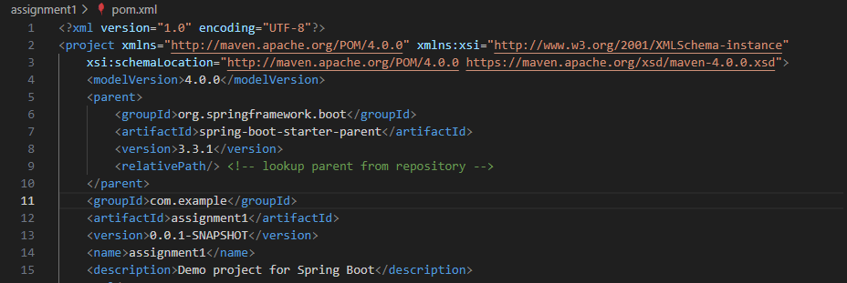

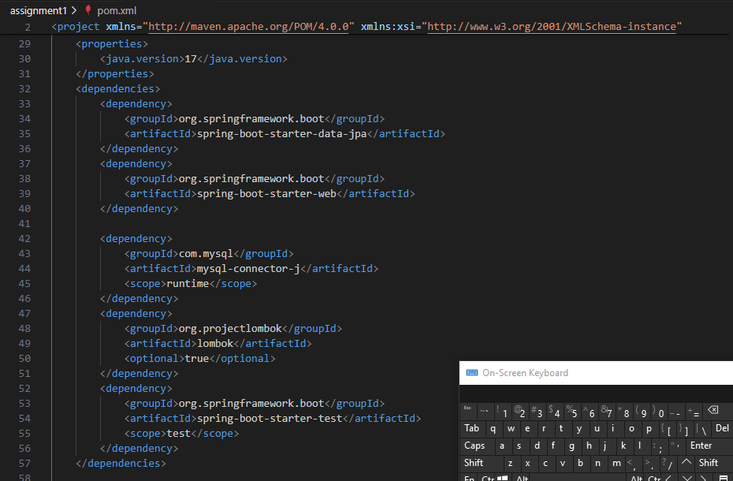

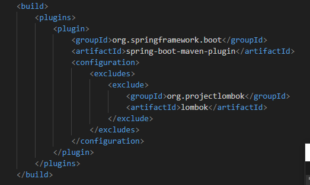

## Database Configuration

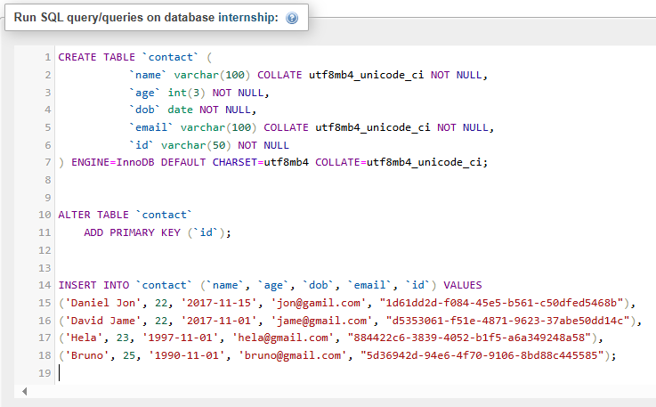

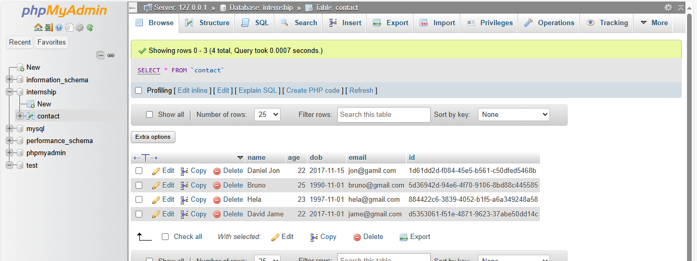

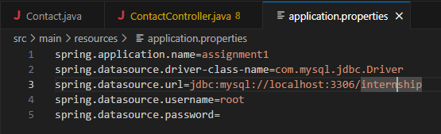

## Model Contact Configuration

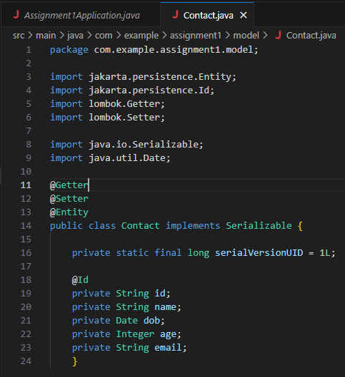

## Repository Contact Configuration

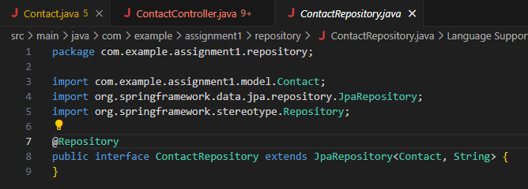

## Controller Contact Configuration

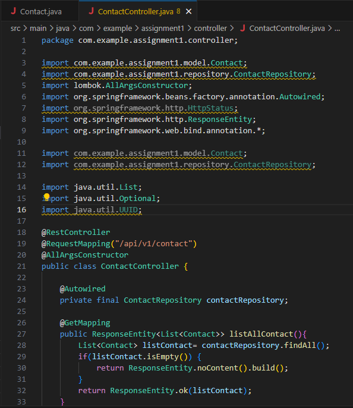

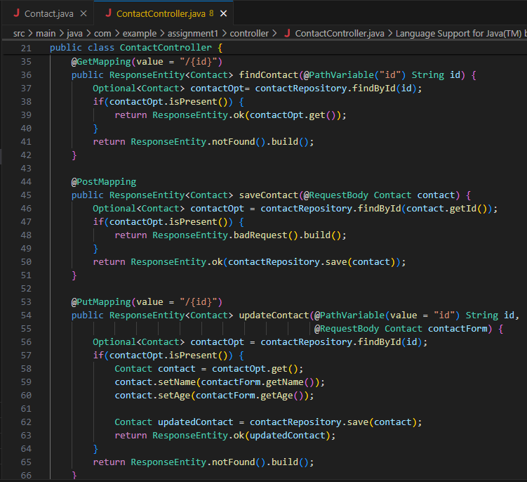

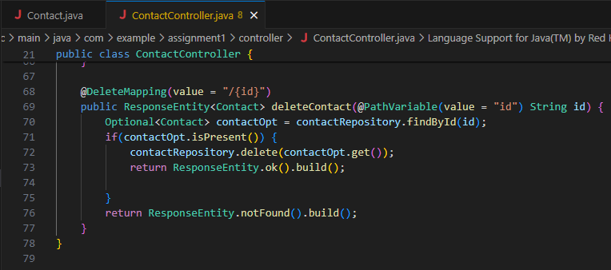

## Running Spring Boot

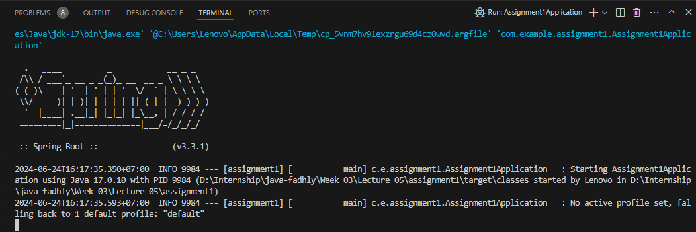

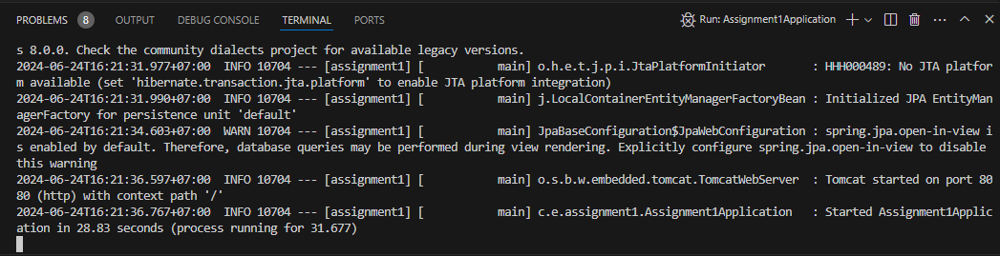

## Testing API Get

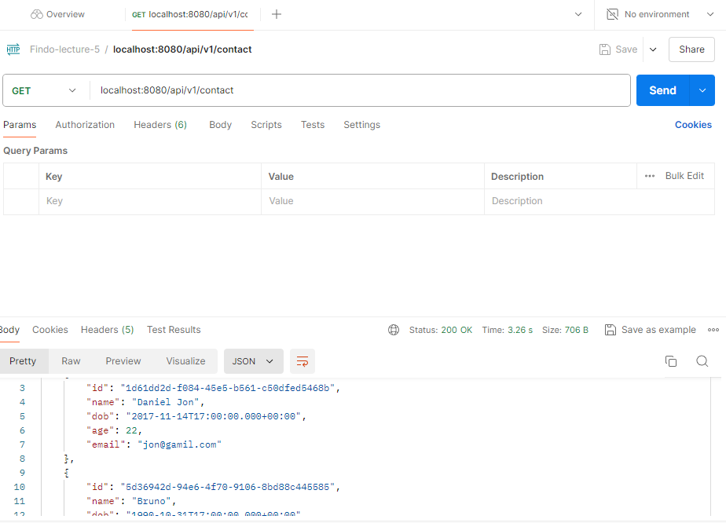

## Testing API Post New Contact

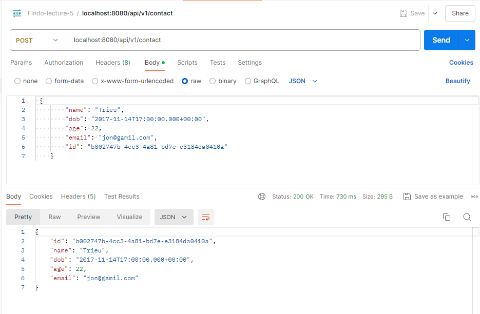

## Testing API Get by ID

## Testing API Edit Contact by Name and Age

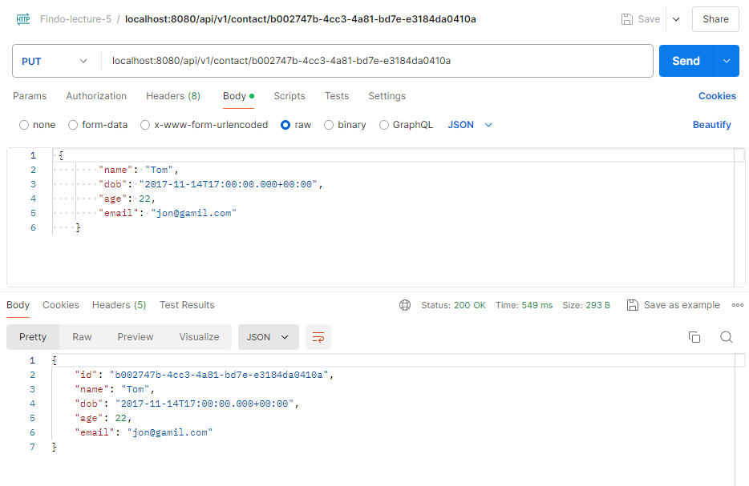

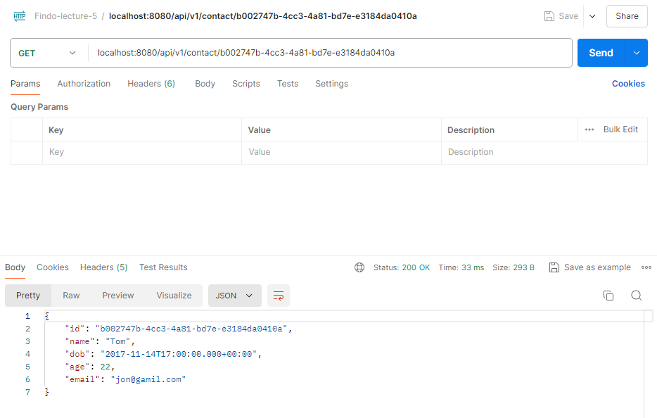

## Testing API Delete Contact

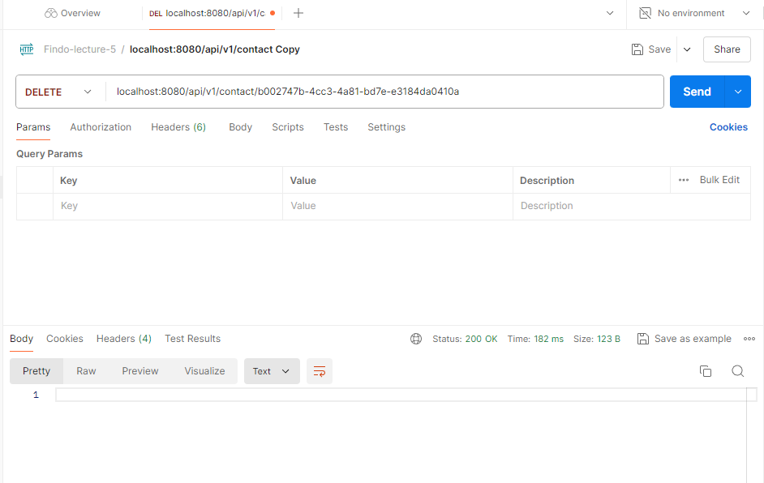

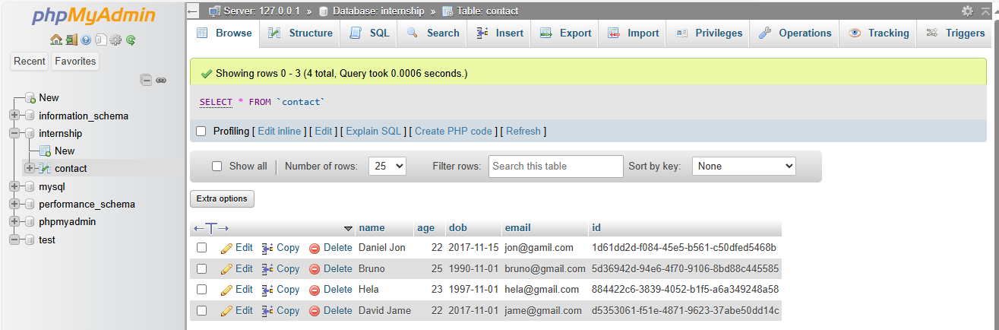