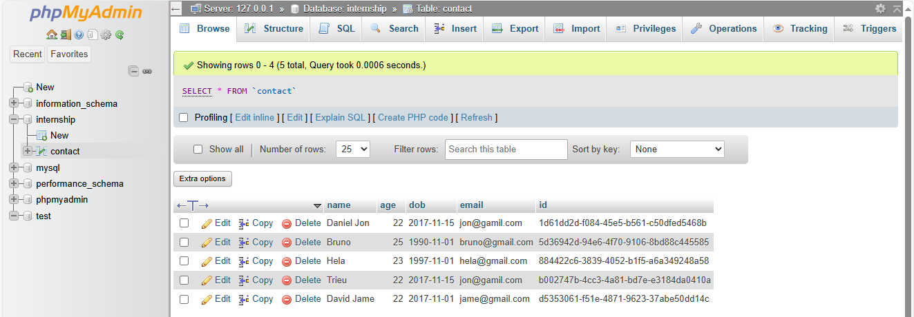
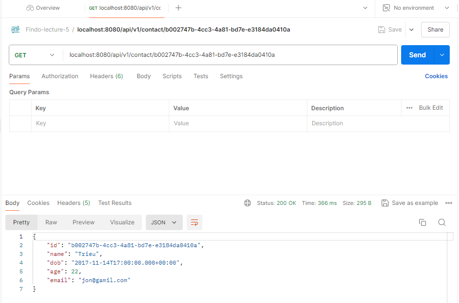

# Assignment 1

## Project Spring Boot Configuration

## Database Configuration

## Model Contact Configuration

## Repository Contact Configuration

## Controller Contact Configuration

## Running Spring Boot

## Testing API Get

## Testing API Post New Contact

## Testing API Get by ID

## Testing API Edit Contact by Name and Age

## Testing API Delete Contact

