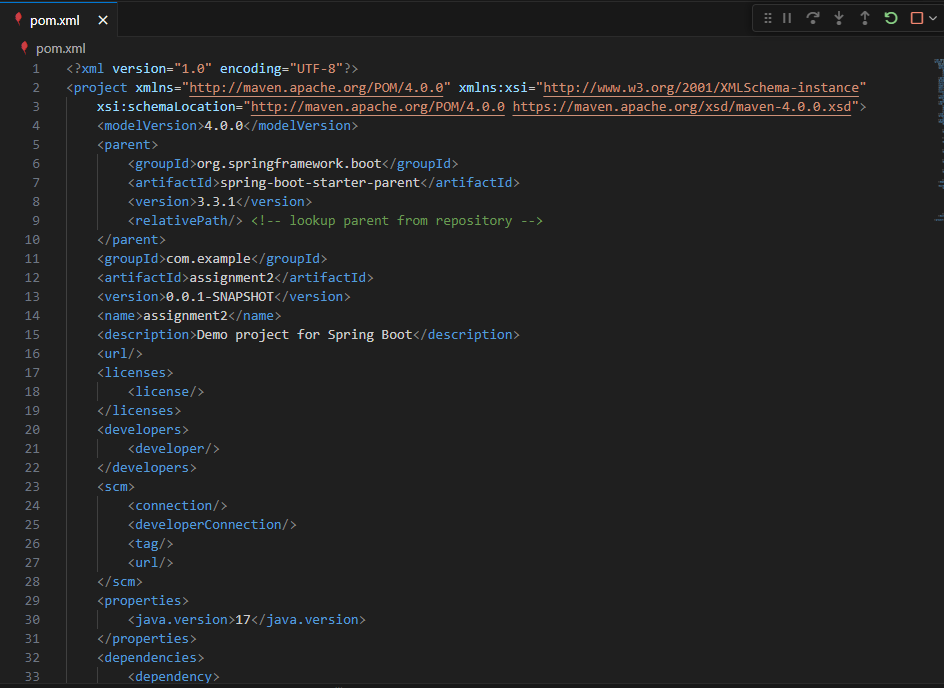
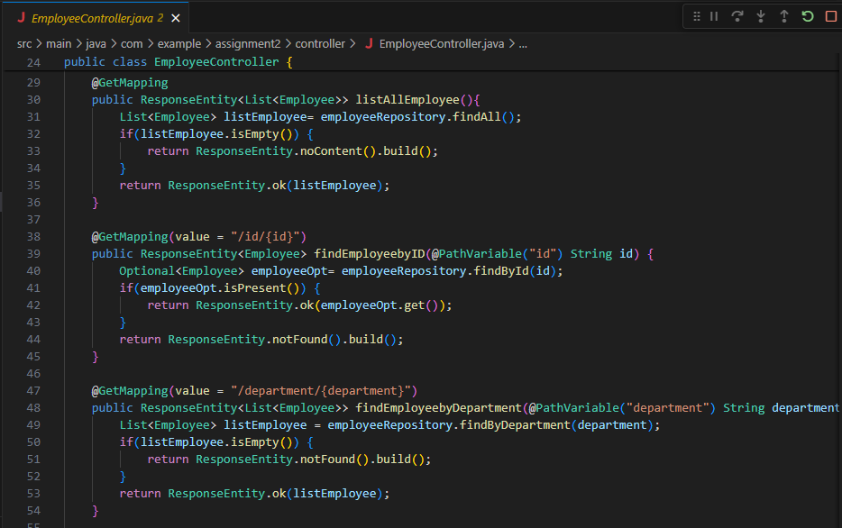
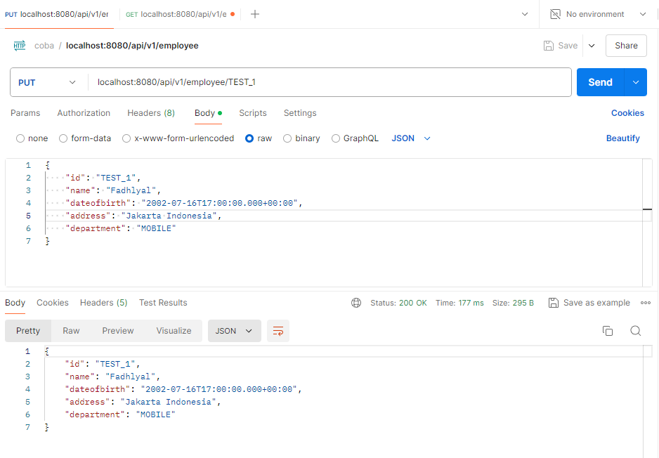

# Assignment2

## Project Spring Boot Configuration

## Database Configuration

## Model Employee Configuration

## Repository Employee Configuration

## Controller Employee Configuration

## Running Spring Boot

## Testing API Post by CSV File

## Testing API Get All Employee Data

## Testing API Get Employee Data by ID

## Testing API Get All Employee Data by Department

## Testing API Post Employee Data by Manual Input

## Testing API Put Employee Name,Address Data

## Testing API Delete Employee Data

