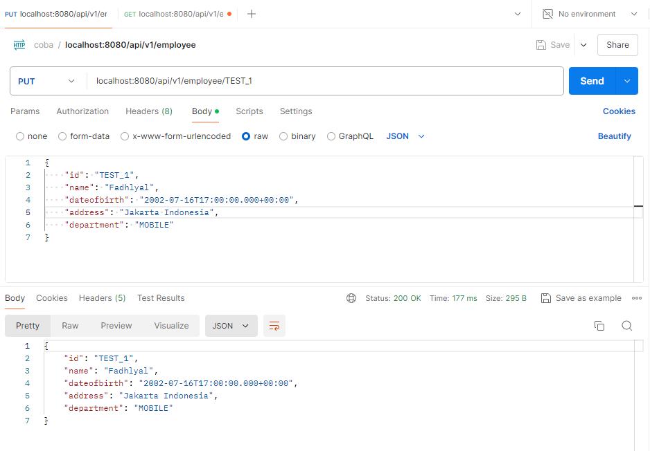
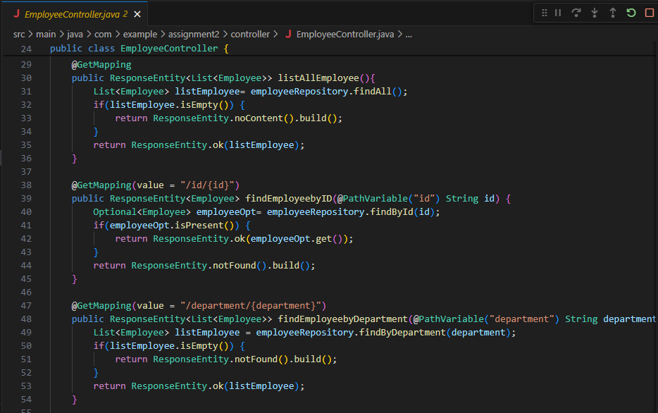
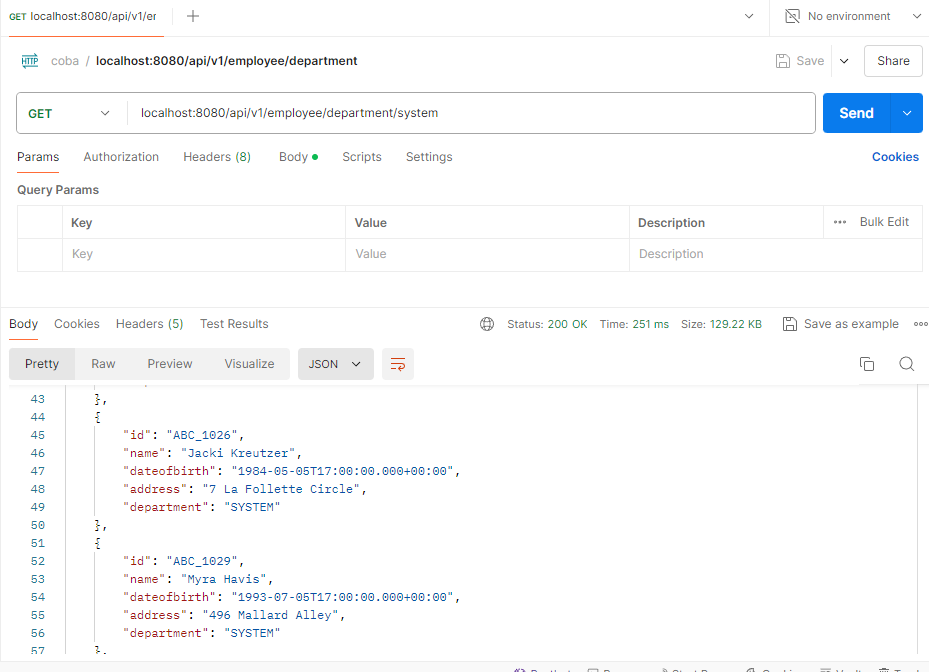
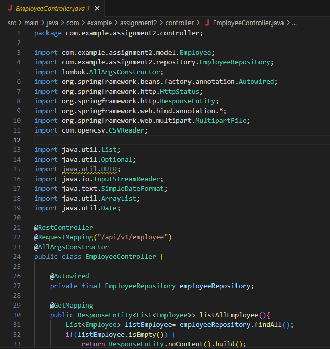

# Assignment 03

## Compare Best Practice API with Assignment 02 Lecture 05

### Accept and respond with JSON

Mine did this

### Use nouns instead of verbs in endpoint paths

Mine did this

### Use logical nesting on endpoints

Mine did this

### Handle errors gracefully and return standard error codes

Mine didn't

### Allow filtering, sorting, and pagination

Mine did filtering, but not pagination

### Maintain good security practices

Mine didn't

### Cache data to improve performance

Mine didn't

### Versioning our APIs

Mine did this

