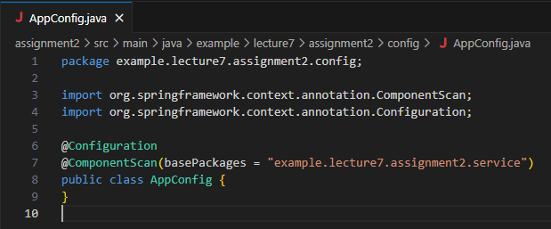
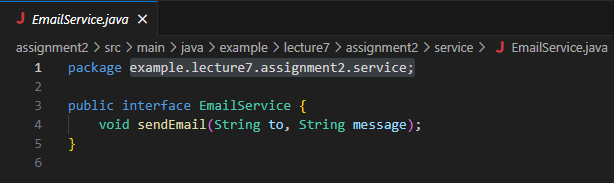
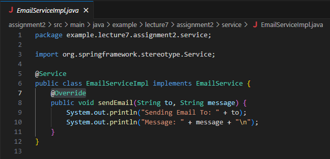

# Assignment 02 - Lecture 07

## Task 01: Create EmailService to Working with Another Stereotype Annotations

### Working Annotations

1. `@SpringBootApplication`
2. `@Service`
3. `@Autowired`
4. `@Configuration`
5. `@ComponentScan`

### Create Config AppConfig



### Create Service EmailService Interface



### Create Service EmailServiceImpl Class



### Create Service EmployeeService Class


### Create Service EmployeeService2 Class


### Create Service EmployeeService3 Class


### Main Application and Result


## Task 02: Compare Constructor Injection, Field Injection, and Setter Injection

### Constructor Injection

`Constructor Injection` involves passing the dependencies required by a class as parameters to the class's constructor. Dependencies are provided when the object is instantiated and class allow to operate with fully initialized dependencies from the start.

#### Advantages

1. **Immutability:** Injected dependencies can be declared as final, making the object immutable
2. **Thread Safety:** Because the object is immutable, so it is inherently thread-safe
3. **Testability:** Easy to write unit test because dependencies are provided through the constructor
4. **Dependencies:** Required dependencies are provided when the object is created

#### Disadvantages

1. **Many Dependencies:** If it has many dependencies, constructor can be difficult to manage
2. **Circular Dependencies:** Can lead to issue circular dependencies

### Field Injection

`Field Injection` involves directly injecting dependencies into the fields of a class using annotations. It is typically done by dependency injection framework and sets values of the fields after the object is created.

#### Advantages

1. **Simplicity:** It quick and straightforward to implement because require least boilerplate code
2. **Flexibility:** Dependencies can injected at any point of object's lifecycle

#### Disadvantages

1. **Immutability:**  Doesn't immutable because the fields need to be non-final
2. **Testability:** More challanging to write unit test as dependencies need to be set by DI framework
3. **Visibiblity:** Dependencies aren't visible like constructor, so hard to understand dependencies required by the class

### Setter Injection

`Setter Injection` involves providing dependencies to a class through setter methods. Dependency injection framework calls setter methods after the object is created, dependencies can be changed after the object’s construction.

#### Advantages

1. **Visibiblity:** More visible and documented through setter methods
2. **Flexibility:** Greater flexibility in the object's lifecycle
3. **Optional Dependencies:** Useful forr configuration that might change after object creation

#### Disadvantages

1. **Immutability:** Doesn't immutable because dependencies can be changed after object creation
2. **Boilerplate Code:** More boilerplate code with additional setter methods

### Comparison

| Feature | Constructor Injection | Field Injection | Setter Injection |
|-|-|-|-|
| **Immutability**| High | Low | Low |
| **Visibility of Dependencies**| High | Low | Medium |
| **Required Dependencies** | Enforced | Not Enforced | Not Enforced |
| **Boilerplate Code** | High (with many dependencies) | Low | Medium |
| **Testability** | High | Medium | Medium |
| **Flexibility** | Low  | High | High |
| **Circular Dependency Handling** | Poor | Medium | Medium |
| **Thread Safety** | High | Low | Low |


## Task 03: [Optional] Research Circular dependency injection

`Circular Dependency Injection` occurs when there are two or more dependencies rely on each other, forming a loop. This can create issues in object instantiation and can make the code harder to maintain and understand. For example `class A` depends on `class B` and `class B` depends on `class A`, directly or maybe from a chain dependencies.

### Advantages

1. **Modularity:** Modular approach by encouraging separation of concerns, as each class is supposed to manage its own dependencies
2. **Flexibility:** More flexible and easier to swap out, where dynamic configurations are needed

### Disadvantages

1. **Complexity:** add complexity to the codebase, harder to understand and maintain
2. **Instantiation:** Problems in object creation, if a dependency injection container doesn't handle circular dependencies
3. **Testing:** It can make unit testing challenging, because harder to isolate classes for testing

### Example of Circular Dependency Injection

```java
import org.springframework.beans.factory.annotation.Autowired;
import org.springframework.context.ApplicationContext;
import org.springframework.context.annotation.AnnotationConfigApplicationContext;
import org.springframework.context.annotation.Bean;
import org.springframework.context.annotation.Configuration;

class A {
    private B b;

    @Autowired
    public void setB(B b) {
        this.b = b;
    }

    public void doSomething() {
        System.out.println("A is doing something");
        b.doSomethingElse();
    }
}

class B {
    private A a;

    @Autowired
    public void setA(A a) {
        this.a = a;
    }

    public void doSomethingElse() {
        System.out.println("B is doing something else");
        a.doSomething();
    }
}

@Configuration
class Config {
    @Bean
    public A a() {
        return new A();
    }

    @Bean
    public B b() {
        return new B();
    }
}

public class Main {
    public static void main(String[] args) {
        ApplicationContext context = new AnnotationConfigApplicationContext(Config.class);
        A a = context.getBean(A.class);
        a.doSomething();
    }
}
```

## Task 04: Explain and Example about Stereotype Annotations

### @Configuration

`@Configuration` indicates that the class contains one or more `@Bean` methods and may be processed by the Spring container to generate bean definitions and service requests for those beans at runtime.

```java
@Configuration
public class AppConfig {
}
```

### @Bean

`@Bean` indicates that a method produces a bean to be managed by the Spring container, usually used with `@Configuration`

```java
@Bean
public MyService myService() {
    return new MyServiceImpl();
}
```

### @ComponentScan

`@ComponentScan` tells Spring where to search for annotated components, usually used with `@Configuration`

```java
@Configuration
@ComponentScan(basePackages = "com.example.myapp")
public class AppConfig {
}
```

### @Component

`@Component` indicates that classes are considered as candidates for auto-detection when using annotation-based configuration and classpath scanning

```java
@Component
public class MyComponent {
}
```

### @Service

`@Service` Specialization of `@Component` for service-layer beans, it makes it easier to identify service classes

```java
@Service
public class MyService {
}
```

### @Repository

`@Repository` provides persistence exception translation, and Specialization of `@Component` for DAO (Data Access Object) classes

```java
@Repository
public class MyRepository {
}
```

### @Autowired

`@Autowired` marks a constructor, field, setter method to be autowired by Spring's dependency injection facilities

```java
@Component
public class MyComponent {
    @Autowired
    private MyService myService;
}
```

### @Scope

`@Scope` will configures the scope of the beans managed by Spring like singleton and prototype

```java
@Component
@Scope("prototype")
public class MyPrototypeBean {
}
```

### @Qualifier

`@Qualifier` used to eliminate the confusion by specifying which exact bean should be wired when use `@Autowired`

```java
@Component
public class MyComponent {

    @Autowired
    @Qualifier("specificBean")
    private MyService myService;
}
```

### @PropertySource

`@PropertySource` provides a convenient and declarative mechanism to Spring's Environment

```java
@Configuration
@PropertySource("classpath:application.properties")
public class AppConfig {
}
```

### @Value

`@Value` used for injecting values into fields in Spring-managed beans

```java
@Component
public class MyComponent {

    @Value("${some.property}")
    private String someProperty;
}
```

### @PreDetroy

`@PreDetroy` indicates a method to be invoked just before the bean is removed from the context

```java
@Component
public class MyComponent {

    @PreDestroy
    public void cleanup() {
    }
}
```

### @PostConstruct

`@PostConstruct` indicates a method to be invoked after dependency injection is done to perform any initialization

```java
@Component
public class MyComponent {

    @PostConstruct
    public void init() {
    }
}
```