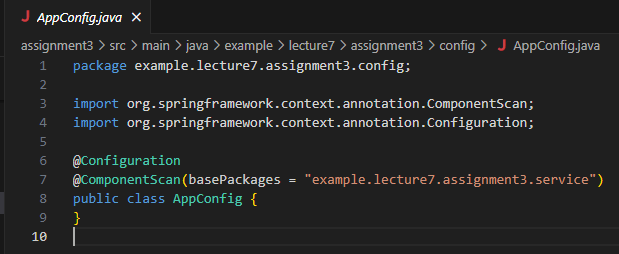
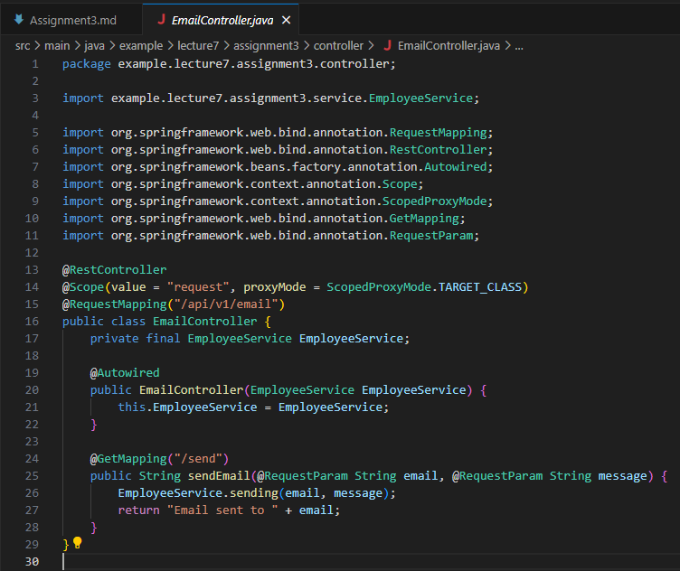

# Assignment 03 - Lecture 07

## Task 01: Like Assigment 02 but with Add Bean Scopes (singleton, prototype)

### Working Annotations

1. `@SpringBootApplication`
2. `@Service`
3. `@Autowired`
4. `@Configuration`
5. `@ComponentScan`
6. `@Scope`

### Create Config AppConfig Class



### Create Service EmailService Interface


### Create Service EmailServiceImpl Class


### Create Service EmployeeService class


### Create Service EmployeeService2 class


### Create Service EmployeeService3 class

![![Service EmployeeService using Setter Injection and @Scope("singleton")]](img/EmployeeService%20with%20Setter%20Injection%20use%20Scope.PNG)

### Main Application and Running


## Task 02: Add Task 01 @RequestScope and Create a Controller

### Working Annotations

1. `@SpringBootApplication`
2. `@Service`
3. `@Autowired`
4. `@Configuration`
5. `@ComponentScan`
6. `@RequestScope`
7. `@RestController`
8. `@RequestMapping`
9. `@GetMapping`

### Dependency to Test @RequestScope

```xml
<dependency>
	<groupId>org.springframework.boot</groupId>
	<artifactId>spring-boot-starter-web</artifactId>
</dependency>
```

### Create Config AppConfig Class


### Create Controller EmailController Class



### Create Service EmailService Interface


### Create Service EmailServiceImpl Class


### Create Service EmployeeService class


### Create Service EmployeeService2 class


### Create Service EmployeeService3 class

![![Service EmployeeService using Setter Injection and @Scope("singleton")]](img/EmployeeService%20with%20Setter%20Injection%20use%20Scope.PNG)

### Main Application and Running


## Task 03: [Optional] Inject Prototype Bean into Singleton Bean

`Prototype Bean` single instance of the bean is created and shared across the entire Spring container
`Singleton Bean` new instance of the bean is created every time it is requested from the Spring container

Inject prototype bean to singleton bean can be achieved by using `@Scope` and `ObjectFactory` or `Provider` from `javax.inject`

### Using ObjectFactory

`Prototype Bean`

```java
import org.springframework.context.annotation.Scope;
import org.springframework.stereotype.Component;

@Component
@Scope("prototype")
public class PrototypeBean {
    public void print() {
        System.out.println("PrototypeBean instance: " + this);
    }
}
```

`Singleton Bean`

```java
import org.springframework.beans.factory.annotation.Autowired;
import org.springframework.beans.factory.annotation.Lookup;
import org.springframework.beans.factory.annotation.Autowired;
import org.springframework.stereotype.Component;

@Component
public class SingletonBean {

    @Autowired
    private ObjectFactory<PrototypeBean> prototypeBeanFactory;

    public void showMessage() {
        PrototypeBean prototypeBean = prototypeBeanFactory.getObject();
        prototypeBean.print();
    }
}
```

`AppConfig`

```java
import org.springframework.context.annotation.ComponentScan;
import org.springframework.context.annotation.Configuration;

@Configuration
@ComponentScan(basePackages = "com.example")
public class AppConfig {
}
```

`Main Application`

```java
import org.springframework.context.ApplicationContext;
import org.springframework.context.annotation.AnnotationConfigApplicationContext;

public class MainApp {
    public static void main(String[] args) {
        ApplicationContext context = new AnnotationConfigApplicationContext(AppConfig.class);
        SingletonBean singletonBean = context.getBean(SingletonBean.class);
        singletonBean.showMessage();
        singletonBean.showMessage();
    }
}
```

### Using Provider

`Dependency`

```xml
<dependency>
    <groupId>javax.inject</groupId>
    <artifactId>javax.inject</artifactId>
    <version>1</version>
</dependency>
```

`Prototype Bean`

```java
@Component
@Scope("prototype")
public class PrototypeBean {
    public void print() {
        System.out.println("PrototypeBean instance: " + this);
    }
}
```

`Singleton Bean`

```java
import javax.inject.Provider;
import org.springframework.beans.factory.annotation.Autowired;
import org.springframework.stereotype.Component;

@Component
public class SingletonBean {

    @Autowired
    private Provider<PrototypeBean> prototypeBeanProvider;

    public void showMessage() {
        PrototypeBean prototypeBean = prototypeBeanProvider.get();
        prototypeBean.print();
    }
}
```

`AppConfig`

```java
@Configuration
@ComponentScan(basePackages = "com.example")
public class AppConfig {
}
```

`Main Application`

```java
public class MainApp {
    public static void main(String[] args) {
        ApplicationContext context = new AnnotationConfigApplicationContext(AppConfig.class);
        SingletonBean singletonBean = context.getBean(SingletonBean.class);
        singletonBean.showMessage();
        singletonBean.showMessage();
    }
}
```

## Task 04: Diference between BeanFactory and ApplicationContext

### Definition BeanFactory

`BeanFactory` is a root for accessing spring container. It will provides basic mechanism for managing beans, like instantiation, configuration, and management of bean dependencies. `BeanFactory` usually used for simple scenario that `ApplicationContext` are not required

### Definition ApplicationContext

`ApplicationContext` is sub-interface of `BeanFactory`, It provides more advanced features. It contains all the features of `BeanFactory` like event propagation, declarative mechanisms to create a bean, and various ways to look up a bean. It also can built-in support for internationalization (i18n), message resource handling, and application-layer specific context

### Diference between BeanFactory and ApplicationContext

| Feature | BeanFactory | ApplicationContext |
|-|-|-|
| **Feature Set** | Provides basic dependency injection and bean management features | Contains al features from `BeanFactory` also can built event propagation, declarative mechanisms to create a bean, and support for internationalization (i18n) |
| **Eager Initialization** | Instantiated lazily, only created when there is a request | Instantiated eagerly, It created at the time of application startup |
| **Event Handling** | Doesn't support event handling | Supports event handling with built-in event publication mechanisms |
| **Internationalization** | Doesn't support internationalization | Support for internationalization using message sources |
| **Automatic Bean Registration** | Does not support automatic registration of `BeanPostProcessors` and `BeanFactoryPostProcessors`. | Automatically registers `BeanPostProcessors` and `BeanFactoryPostProcessors`. |
| **Convenience Methods** | Didn't provide for various convenience method for accessing environment variables, system properties, and resources | Provides various convenience methods for accessing environment variables, system properties, and resources |