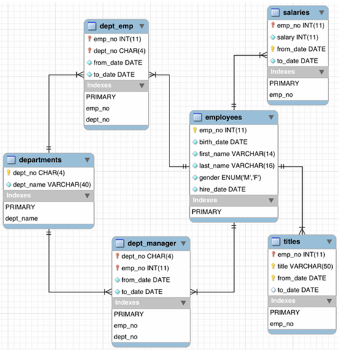

# Assignment 01

In this week, we learned about Data JPA in Spring Boot Project. There were some assignment to do, like Create Entitites from ERD that given, Manage Employees Table, Manage Departments Table, Manage Salaries and Titles Table, and at the end we should research about composite key in Data JPA that we used to build our table in the ERD.

## Dependencies Project

1. `Spring Data JPA` -> To create CRUD, interact with Database, and create entities
2. `Spring Starter Web` -> To create RESTful web services, HTTP Requests, and develop web app
3. `Spring Boot Devtools` -> To provide automatic reload server and configuration
4. `MySQL Connector` -> To connect with MySQL Database and manage database transaction
5. `Lombok` -> To create boilerplate code like Setter, Getter, Constructor and other

[Dependencies File](assignment1\pom.xml)

## Task 01: Create Entities as a ERD

 Should create entities from this ERD

### Create Database

[Create Table using Query](table.sql) This query contains create Database, use Database, create of each tables in ERD, and have some dummy data to test


### Connect Database

[Application Properties](assignment1\src\main\resources\application.properties) This file used to connect Database to the Project

### Create Entity and Data Repository of employees Table

[Entity Employee](assignment1\src\main\java\example\lecture11\assignment1\entity\Employee.java) This file will create entity from database table name `employees` include all the column, that have relation with `dept_emp` table, `dept_manager` table, `salaries` table, and `titles` table

1. `Getter` -> Annotation that generates getter method from all fields
2. `Setter` -> Annotation that generates setter method from all fields
3. `Entity` -> Annotation that specifies class is an entity from database
4. `Table` -> Annotation that specifies name of table in database
5. `Id` -> Annotation that specifies primary key
6. `Column` -> Annotation that specifies database column to entity field
7. `GeneratedValue` -> Annotation that specifies primary key will generated automatically
8. `OneToMany` -> Annotation that specifies one to many relationship with other entities

[Repository Employee](assignment1\src\main\java\example\lecture11\assignment1\repository\EmployeeRepository.java) This file will create JPA Repository for `Employee Entity`

1. `Repository` -> Annotation that applies class to directly access the database

### Create Entity and Data Repository of departments Table

[Entity Department](assignment1\src\main\java\example\lecture11\assignment1\entity\Department.java) This file will create entity from database table name `departments` include all the column, that have relation with `dept_emp` table, and `dept_manager` table

1. `Getter` -> Annotation that generates getter method from all fields
2. `Setter` -> Annotation that generates setter method from all fields
3. `Entity` -> Annotation that specifies class is an entity from database
4. `Table` -> Annotation that specifies name of table in database
5. `Id` -> Annotation that specifies primary key
6. `Column` -> Annotation that specifies database column to entity field
7. `OneToMany` -> Annotation that specifies one to many relationship with other entities

[Repository Department](assignment1\src\main\java\example\lecture11\assignment1\repository\DepartmentRepository.java) This file will create JPA Repository for `Department Entity`

1. `Repository` -> Annotation that applies class to directly access the database

### Create Entity of dept_emp Table

[Entity DepartmentEmployee](assignment1\src\main\java\example\lecture11\assignment1\entity\DepartmentEmployee.java) This file will create entity from database table name `dept_emp` include all the column, that have relation with `employees` table and `departments` table

1. `Getter` -> Annotation that generates getter method from all fields
2. `Setter` -> Annotation that generates setter method from all fields
3. `Entity` -> Annotation that specifies class is an entity from database
4. `Table` -> Annotation that specifies name of table in database
5. `IdClass` -> Annotation that specifies composite key
6. `Id` -> Annotation that specifies primary key
7. `Column` -> Annotation that specifies database column to entity field
8. `ManyToOne` -> Annotation that specifies many to one relationship with other entities
9. `JoinColumn` -> Annotation that specifies foreign key column to join an entitiy
10. `JsonIgnore` -> Annotation that instructs to ignore property during serialization and deserialization

[Composite Key DeptEmpId](assignment1\src\main\java\example\lecture11\assignment1\entity\DeptEmpId.java) This file create composite key from `dept_emp` table, to store multiple primary and foreign key

1. `Getter` -> Annotation that generates getter method from all fields
2. `Setter` -> Annotation that generates setter method from all fields
3. `NoArgsConstructor` -> Annotation that generates no-argument constructor
4. `EqualsAndHashCode` -> Annotation that generates `equals` and `hashcode` method
5. `Serializable` -> Make a class as `serializable` to allow instance be converted to byte stream

### Create Entity of dept_manager Table

[Entity DepartmentManager](assignment1\src\main\java\example\lecture11\assignment1\entity\DepartmentManager.java) This file will create entity from database table name `dept_manager` include all the column, that have relation with `employees` table and `departments` table

1. `Getter` -> Annotation that generates getter method from all fields
2. `Setter` -> Annotation that generates setter method from all fields
3. `Entity` -> Annotation that specifies class is an entity from database
4. `Table` -> Annotation that specifies name of table in database
5. `IdClass` -> Annotation that specifies composite key
6. `Id` -> Annotation that specifies primary key
7. `Column` -> Annotation that specifies database column to entity field
8. `ManyToOne` -> Annotation that specifies many to one relationship with other entities
9. `JoinColumn` -> Annotation that specifies foreign key column to join an entitiy
10. `JsonIgnore` -> Annotation that instructs to ignore property during serialization and deserialization

[Composite Key DeptManagerId](assignment1\src\main\java\example\lecture11\assignment1\entity\DeptManagerId.java) This file create composite key from `dept_manager` table, to store multiple primary and foreign key

1. `Getter` -> Annotation that generates getter method from all fields
2. `Setter` -> Annotation that generates setter method from all fields
3. `NoArgsConstructor` -> Annotation that generates no-argument constructor
4. `EqualsAndHashCode` -> Annotation that generates `equals` and `hashcode` method
5. `Serializable` -> Make a class as `serializable` to allow instance be converted to byte stream

### Create Entity and Data Repository of salaries Table

[Entity Salary](assignment1\src\main\java\example\lecture11\assignment1\entity\Salary.java) This file will create entity from database table name `salaries` include all the column, that have relation with `employees` table

1. `Getter` -> Annotation that generates getter method from all fields
2. `Setter` -> Annotation that generates setter method from all fields
3. `Entity` -> Annotation that specifies class is an entity from database
4. `Table` -> Annotation that specifies name of table in database
5. `Id` -> Annotation that specifies primary key
6. `Column` -> Annotation that specifies database column to entity field
7. `OneToMany` -> Annotation that specifies one to many relationship with other entities

[Composite Key SalaryId](assignment1\src\main\java\example\lecture11\assignment1\entity\SalaryId.java) This file create composite key from `salaries` table, to store multiple primary and foreign key

1. `Getter` -> Annotation that generates getter method from all fields
2. `Setter` -> Annotation that generates setter method from all fields
3. `NoArgsConstructor` -> Annotation that generates no-argument constructor
4. `EqualsAndHashCode` -> Annotation that generates `equals` and `hashcode` method
5. `Serializable` -> Make a class as `serializable` to allow instance be converted to byte stream 

[Repository Salary](assignment1\src\main\java\example\lecture11\assignment1\repository\SalaryRepository.java) This file will create JPA Repository for `Salary Entity`

1. `Repository` -> Annotation that applies class to directly access the database

### Create Entity and Data Repository of titles Table

[Entity Title](assignment1\src\main\java\example\lecture11\assignment1\entity\Title.java) This file will create entity from database table name `titles` include all the column, that have relation with `employees` table

1. `Getter` -> Annotation that generates getter method from all fields
2. `Setter` -> Annotation that generates setter method from all fields
3. `Entity` -> Annotation that specifies class is an entity from database
4. `Table` -> Annotation that specifies name of table in database
5. `Id` -> Annotation that specifies primary key
6. `Column` -> Annotation that specifies database column to entity field
7. `OneToMany` -> Annotation that specifies one to many relationship with other entities

[Composite Key TitleId](assignment1\src\main\java\example\lecture11\assignment1\entity\TitleId.java) This file create composite key from `titles` table, to store multiple primary and foreign key

1. `Getter` -> Annotation that generates getter method from all fields
2. `Setter` -> Annotation that generates setter method from all fields
3. `NoArgsConstructor` -> Annotation that generates no-argument constructor
4. `EqualsAndHashCode` -> Annotation that generates `equals` and `hashcode` method
5. `Serializable` -> Make a class as `serializable` to allow instance be converted to byte stream 

[Repository Title](assignment1\src\main\java\example\lecture11\assignment1\repository\TitleRepository.java) This file will create JPA Repository for `Title Entity`

1. `Repository` -> Annotation that applies class to directly access the database

## Task 02: Manage Employees

[Service Employee](assignment1\src\main\java\example\lecture11\assignment1\service\EmployeeService.java) This file contains interface of service method like, show data, save data, update data, and delete data

[Service Implementation Employee](assignment1\src\main\java\example\lecture11\assignment1\service\Impl\EmployeeServiceImpl.java) This file contains implementation of the interface before

[Controller Employee](assignment1\src\main\java\example\lecture11\assignment1\controller\EmployeeController.java) This file contains HTTP Request of the `Employee`, URL path that will handle request is `/api/v4/employee`

1. `Service` -> Annotation that indicates class that provide business logic
2. `AllArgsConstructor` -> Annotation that generates constructor with parameter from each field
3. `RestController` -> Annotation that creates RESTful web service
4. `RequestMapping("Path")` -> Annotation that makes HTTP request base path
5. `GetMapping` -> Annotation that maps HTTP GET requests
6. `PostMapping` -> Annotation that maps HTTP POST requests
7. `PutMapping` -> Annotation that maps HTTP PUT requests
8. `DeleteMapping` -> Annotation that maps HTTP DELETE requests

### Show List of Employees with Paging


`Show by Id`


### Add Employee


### Update Employee


### Delete Employee


## Task 03: Manage Departments

[Service Department](assignment1\src\main\java\example\lecture11\assignment1\service\DepartmentService.java) This file contains interface of service method like, show data, save data, update data, and delete data

[Service Implementation Department](assignment1\src\main\java\example\lecture11\assignment1\service\Impl\DepartmentServiceImpl.java) This file contains implementation of the interface before

[Controller Department](assignment1\src\main\java\example\lecture11\assignment1\controller\DepartmentController.java) This file contains HTTP Request of the `Department`, URL path that will handle request is `/api/v4/department`

1. `Service` -> Annotation that indicates class that provide business logic
2. `AllArgsConstructor` -> Annotation that generates constructor with parameter from each field
3. `RestController` -> Annotation that creates RESTful web service
4. `RequestMapping("Path")` -> Annotation that makes HTTP request base path
5. `GetMapping` -> Annotation that maps HTTP GET requests
6. `PostMapping` -> Annotation that maps HTTP POST requests
7. `PutMapping` -> Annotation that maps HTTP PUT requests
8. `DeleteMapping` -> Annotation that maps HTTP DELETE requests

### Show List of Departments with Paging


`Show Department by Id`


### Add Department


### Update Department


### Delete Department


## Task 04: Manage Salary and Title

[Service Salary](assignment1\src\main\java\example\lecture11\assignment1\service\SalaryService.java) This file contains interface of service method like, show data, save data, update data, and delete data

[Service Implementation Salary](assignment1\src\main\java\example\lecture11\assignment1\service\Impl\SalaryServiceImpl.java) This file contains implementation of the interface before

[Controller Salary](assignment1\src\main\java\example\lecture11\assignment1\controller\SalaryController.java) This file contains HTTP Request of the `Salary`, URL path that will handle request is `/api/v4/salary`

1. `Service` -> Annotation that indicates class that provide business logic
2. `AllArgsConstructor` -> Annotation that generates constructor with parameter from each field
3. `RestController` -> Annotation that creates RESTful web service
4. `RequestMapping("Path")` -> Annotation that makes HTTP request base path
5. `PostMapping` -> Annotation that maps HTTP POST requests
6. `PutMapping` -> Annotation that maps HTTP PUT requests

### Add Salary to Employee


### Update Salary from Employee


### Add Title to Employee


### Update Title from Employee


## Task 05: Research in Data JPA - Composite Key

### Explanation Composite Key

Composite key is a primary key that consist more than one column in database table. These columns together uniquely identify a record in the table. Composite can also combination of primary key and foreign key or consist all foreign key, but in the table it will become primary key. It used to handle complex database relationships.

Here's the example of using composite key in data JPA and Spring Boot Project. There were 2 ways to use composite key, using annotation `@IdClass` or `@EmbeddedId`.

`Example using @IdClass`

```java
import java.io.Serializable;
import javax.persistence.*;

@Entity
@IdClass(EmployeeId.class)
public class Employee {
    @Id
    private Long empNo;
    @Id
    private String deptNo;

    private String name;
    // other fields, getters, and setters
}

public class EmployeeId implements Serializable {
    private Long empNo;
    private String deptNo;

    // default constructor, equals, and hashCode methods
}
```

Composite key in class `Employee` are `empNo` and `deptNo`. It stores in other class name `EmployeeId`. Class `EmployeeId` called in class `Employee` by annotation `@IdClass` before declaration the class, and annotation `@Id` before declaration the field of the composite key.

`Example using @EmbeddedId`

```java
import java.io.Serializable;
import javax.persistence.*;

@Entity
public class Employee {
    @EmbeddedId
    private EmployeeId id;

    private String name;
    // other fields, getters, and setters
}

@Embeddable
public class EmployeeId implements Serializable {
    private Long empNo;
    private String deptNo;

    // default constructor, getters, setters, equals, and hashCode methods
}
```

Composite key in class `Employee` is `id` with type of `EmployeeId` that have annotation `@EmbeddedId`. In `EmployeeId` class have annotation `@Embeddable` and it contains composite key `empNo` and `deptNo`.

### Advantages using Composite Key

1. `Uniqueness` -> Each record is uniquely identify by combination of the columns
2. `Data Integrity` -> It can preventing duplicate records by combination of the fields
3. `Simplified Queries` -> It can be simplify queries by allowing natural relationships that represented directly to database

### Disadvantages using Composite Key

1. `Complexity` -> Add complexity because it should handle multiple fields as single unit
2. `Foreign Key` -> Can be more complicated because need to match combination columns
3. `Maintenance` -> Change the key structure can be more challanging to database schema and application code

So basically composite key is good to use, because it can contain uniquely identify for the record but there some challange to use it such as more complexity and challanging to database schema.