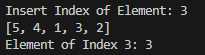

# Assignment 5

## Assignment 5.1 (Comparison)

### ArrayList vs LinkedList

Both are implement of the list interface and maintain insertion order, also non-syncronized classes.

`ArrayList` is a resizable array implementation of list interface that the array dynamically can grow as needed to accommodate more elements.

`LinkedList` is a doubly implementation of the list and deque interface that consists of the nodes where the node have reference to the next or previous node.

#### Example of using ArrayList and LinkedList

| ArrayList | LinkedList |
| - | - |
| Implement list of items that need to access frequently by index | Implement doubly-ended dequeue where need to add and remove elements from both ends |
| Implement stack `LIFO` or queue `FIFO` | implement that elements where frequent insertions and deletions are required especially in the middle |
| Implement that data doesn't change frequently | Implement complex data structure like graphs or adjacency lists |

### HashSet vs TreeSet vs LinkedHashSet

| | HashSet | TreeSet | LinkedHashSet |
| - | - | - | - |
| Order | Not maintain of order | Order according by natural ordering or specified comparator | Insertion order |
| Null Element | Allow one null element | Doesn't allow null element | Allow one null element |
| Performance (add, remove, contains) | Hash table structure O(1) | Traversing tree structure O(log n) | Hash table structure O(1) |
| Syncronized | Not Syncronized | Not Syncronized | Not Syncronized |
| Iterator | Fail-fast | Fail-fast | Fail-fast |

#### Example of using HashSet, TreeSet, LinkedHashSet

1. `HashSet` use this when no need to maintain order of elements, fast performance or need to ensure uniqueness.
    - Tracking of unique usernames in system.
    - Implenting cache that need insertion speed
2. `TreeSet` use this when need maintain order and unique of elements or fine with slower performance
    - Storing names in alphabetical order.
    - Managing leaderboard that score will sorted from highest to lowest.
3. `LinkedHashSet` use this when prevent order insertion, fast performance, and uniqueness.
    - Implementing queue order by arrival.
    - Keeping log event order by occured.

## Assignment 5.2 (Retrieve an Element)

`The code can be run from the src source from this folder.`




## Assignment 5.3 (Remove Duplicated Data)

`The code can be run from the src source from this folder.`


## Assignment 5.4 (Copy Hashmap)

`The code can be run from the src source from this folder.`


## Assignment 5.5 (Convert List to Map)

`The code can be run from the src source from this folder.`


## Assignment 5.6 (Demo CopyOnWriteArrayList)

## Assignment 5.7 (Demo ConcurrencyHashMap)

## Assignment 5.8 (Equal() and Hashcode())

`Equal()` and `Hashcode()` methods are fundamental components for determining object equality and functioning of hash-based collections.

### Equal()

`Equal()` method is used to compare two objects for equality, based on memory addresses of the objects (reference equality).

```java
    @Override
    public boolean equals(Object obj) {
        if (this == obj) {
            return true;
        }
        if (obj == null || getClass() != obj.getClass()) {
            return false;
        }
        Book book = (Book) obj;
        return title.equals(book.title) && author.equals(book.author);
    }
```

### Hashcode()

`Hashcode()`method provides an integer representation of the object, which is used in hashing-based collections. If it is invoked on the same object more than once during an execution, the `hashCode` method must consistently return the same integer, two objects are equal according to the `equals(Object)` method, `hashCode` method produce the same integer result, and two objects are unequal according to the `equals(Object)` method, `hashCode` method on each of the two objects must produce distinct integer.

```java
    @Override
    public int hashCode() {
        return Objects.hash(name, age);
    }
```

## Assignment 5.9 (Check Duplicate)

`The code can be run from the src source from this folder.`


## Assignment 5.10 (Map of Employee with Composite Key)

## Assignment 5.11 (Fix Code Issue)

### Code Before

```java
public static void demo1() {
    List<String> data = newArrayList<>();
    data.add("Joe");
    data.add("Helen");
    data.add("Test");
    data.add("Rien");
    data.add("Ruby");
    for (String d: data){
        if (d.equals("Test")){
            data.remove(d);
        }
    }
}
```

It will have a exception called ConcurrentModificationException, it caused by the `for` loop internally uses an iterator to traverse the list, and any structural modification (like removing an element) during this iteration process will invalidate the iterator.

To solve this with safely remove elements from a list during iteration, should use an Iterator explicitly or collect the items to be removed in a separate collection and remove them after the iteration.

### Code Fixed

```java
public static void demo1() {
    List<String> data = new ArrayList<>();
    data.add("Joe");
    data.add("Helen");
    data.add("Test");
    data.add("Rien");
    data.add("Ruby");

    Iterator<String> iterator = data.iterator();
    while (iterator.hasNext()) {
        String d = iterator.next();
        if (d.equals("Test")) {
            iterator.remove();
        }
    }
}
```

## Assignment 5.12 (Shared Collection Concurrently -> ConcurrencyModificationException)

When it happen without proper synchronization it can lead to unpredictable behavior and potential errors, including `ConcurrentModificationException`.

1. `Inconsistent State`: Multiple threads modifying the collection simultaneously can cause it to enter an inconsistent state, leading to incorrect or unexpected behavior.
2. `ConcurrentModificationException`: This is because the collection's internal state changes while it is being traversed, invalidating the iterator.
3. `Data Corruption`: For instance, if two threads try to add elements to a list at the same time, the final state of the list might not include all added elements.

```java
    public static void main(String[] args) {
        List<String> sharedList = new ArrayList<>();
        sharedList.add("Joe");
        sharedList.add("Helen");

        Runnable task1 = () -> {
            for (int i = 0; i < 10; i++) {
                sharedList.add("Task1-" + i);
            }
        };

        Runnable task2 = () -> {
            for (int i = 0; i < 10; i++) {
                sharedList.add("Task2-" + i);
            }
        };

        Thread thread1 = new Thread(task1);
        Thread thread2 = new Thread(task2);

        thread1.start();
        thread2.start();
    }
```

### How to Handle

1. `Synchronized Collections`: These wrappers synchronize access to the collection methods, ensuring that only one thread can access them at a time.
2. `Concurrent Collections`: Use for concurrent access without the need for explicit synchronization.
3. `Explicit Synchronization`: Use synchronized blocks to control access to the shared collection.